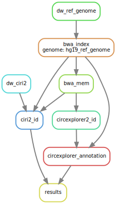

title: Manual user
author: G. Molano, LA.


### Table of Contents
* [Installation](#installation)
  1. [Setting your working directory](setting-your-working-directory)
  2. [Dependencies](#dependencies)
* [Workflow](#workflow)
  1. [Quality Control](#quality-control)
  2. [Alignment and identification](#alignment-and-identification)

***
The aim of this file is guide you in the installation and execution of the workflow.

# Installation
This is the recommended way to install the required dependencies for a proper performance of the workflow. A conda environment  will be create to install and manage all the required programmes.

## Setting your working directory
First of all, download and unzip the `circrna_workflow` folder from [OneDrive](https://idibell-my.sharepoint.com/:f:/g/personal/lgonzalezm_idibell_cat/EpOC5lhue0hImsDyT5SxBegBLxDD2Hi-kdpc2pM75YogVg?e=Ny79Vn).

For the correct performance of the script, we have to generate a text file containing the filenames of our samples. To facilitate the process, we are going to run a bash script, indicating the termination of our samples.
```{bash}
cd path/to/circrna_workflow/
chmod +x src/filenames.sh
./src/filenames.sh _sub_[1,2]_val_[1,2].fq.gz
```

## Dependencies
### Python3
```{bash}
sudo apt-get update
sudo apt-get install python3.8 python3-pip
```

### Anaconda
To facilitate the installation and managing of the rest of programmes , we will use the [Anaconda](https://www.anaconda.com/) distribution and the package manager [conda](https://conda.io/projects/conda/en/latest/index.html).

Anaconda is an optimized Python and R distribution, having pre-built and pre-configured collection of packages that can be installed and used on a system. Anaconda uses a package manager named `conda`, which can not only built and manage software from Python language, but also from any type of programming language. Additionally, we also will use another package manager called `mamba` to make easier the installation of `snakemake` tool.

package manager
: is a tool that automates the process of installing, updating, and removing packages.

To install Anaconda distribution on Linux follow the steps. For toher operating system check the [man page](https://conda.io/projects/conda/en/latest/user-guide/install/linux.html):
1. Download the installer of Anaconda for Linux ([here](https://www.anaconda.com/products/individual)].
2. In your terminal window (ALT+Ctl+T), go to the directory containing the downloaded installer.
3. Run:
```{bash}
bash Anaconda-latest-Linux-x86_64.sh
conda update
```
4. Follow the prompts on the installer screens. In front of any doubt, accept the defaults settings. They can be changed later.
5. To make the changes take effect, close and re-open your terminal window.
6. Test your installation. In your terminal window run the command `conda list`, which will show a list of installed packages if it has been installed correctly.

In order to make visible to your system and be able to run all the pre-installed programmes with Anaconda distribution from anywhere, is necessary to modify your $PATH variable:
1. Open the following document with root privileges:
```{bash}
sudo nano /etc/profile
```
2. Modify the document, adding at the top of the document:
```{bash}
export PATH=$PATH:/your/path/to/anaconda3/bin:/your/path/to/anaconda3/condabin
```
This file will be run upon login for all current and future users, affecting global settings. To modify the PATH variable for a specific user:
```{bash}
sudo nano ~/.profile

# Add at the top of the profile file:
export PATH=$PATH:/your/path/to/anaconda3/bin
```
3. Reload the profile file:
```{bash}
source /etc/profile
```
4. Verify that $PATH has been modified and the path to anaconda has been added:
```
$PATH
```
#### Conda channels
There are several available repositories (called `channels`) to install packages. To add this channels:
```{bash}
conda config --add channels defaults
conda config --add channels bioconda
conda config --add channels conda-forge
```
**Note: the order of adding these channels is important**

### Installing Snakemake
To create a reproducible and scalable data analysis we have used the Snakemake workflow management system, which is a Python-based tool. To simplify the installation of this programme, we will use the `mamba` package manager.

```{bash}
conda update
conda install mamba
mamba install -c conda-forge -c bioconda snakemake
```

# Workflow
## Alignment and Identification

```{bash}
cd /path/to/circrna_workflow
snakemake --cores all \
          --use-conda \
          --snakefile src/alignment_and_identification.Snakefile
```
